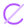

<div align="center">

[](https://git.io/typing-svg)

</div>



###  `// NYXAR`

**Nyxar** — a black wolf on the border between the physical and the digital.
Not a hero, not a hacker, not a machine — just a creature who **can't ignore a broken thing**.
He has no favourite technology, only a favourite moment: *the one where it finally makes sense.*

```text
NYXAR // SYSTEM
──────────────────────────
loop    : understand → break → change → build → verify
carry   : backpack · headphones · notebook · toolkit · cold coffee
signal  : фиолетовая нить в хвосте ярче, когда VOID
state   : VOID — предельная концентрация, а не тёмная сторона
> «я просто хотел понять, почему оно работает»  ...а потом уже ночь
```


###  `// toolkit`

<div align="center">


</div>


###  `// traces`

<div align="center">

[](https://github.com/ashutosh00710/github-readme-activity-graph)

</div>


###  `// uplink`

<div align="center">

[](https://t.me/Divarion_D)
[](https://instagram.com/Divarion-D)
[](https://github.com/Divarion-D)

</div>


###  `// current focus`

<div align="center">

**▸ Developing next-gen streaming solutions at [XC_VM](https://github.com/Vateron-Media)**

</div>


